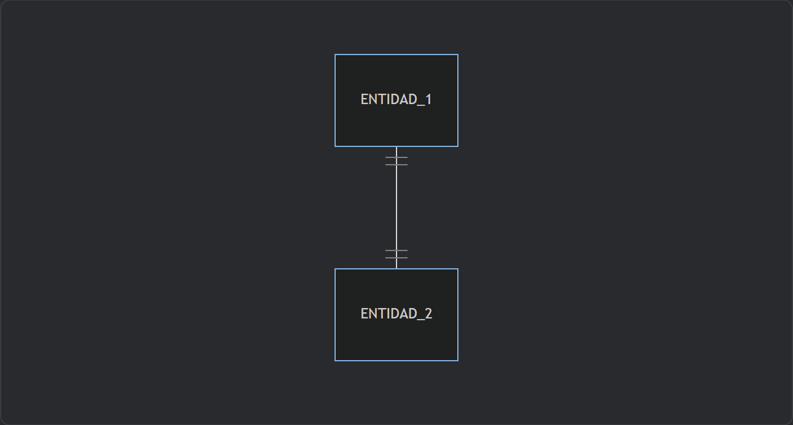
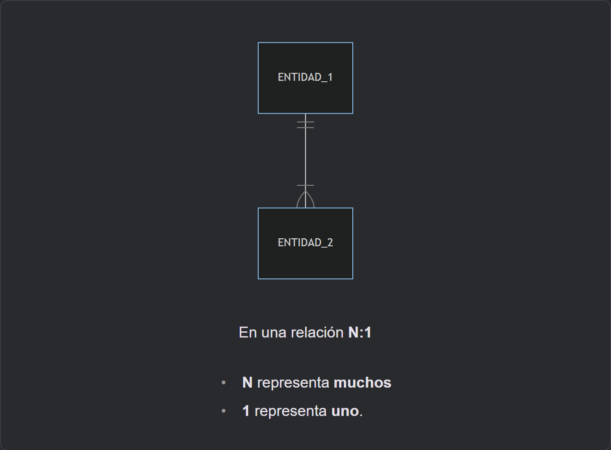
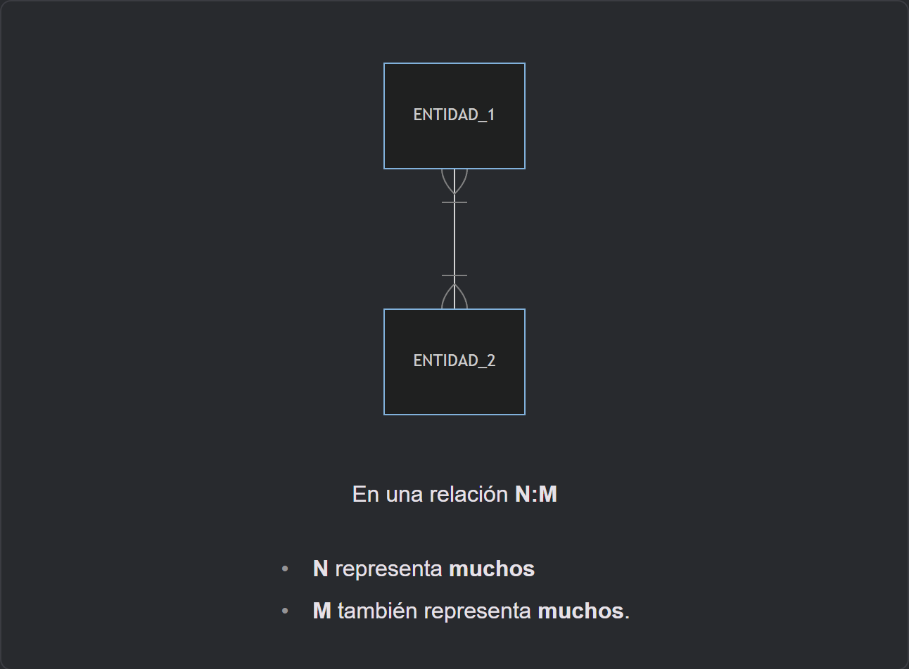

---

sidebar_position: 1
title: Relaciones entre Entidades

---

# Relaciones entre Entidades

Las relaciones entre entidades en modelos de datos, como el modelo relacional, son fundamentales para capturar y representar la manera en que los objetos o conceptos están interconectados en un sistema o dominio específico. Estas relaciones son esenciales para reflejar la estructura lógica de la información y su contexto en el mundo real.

<Card>

### Definición

Una relación entre entidades describe cómo están vinculados los objetos o conceptos en el dominio del problema.

**Ejemplo:** En una base de datos de una tienda en línea, podría haber una relación entre las entidades “Clientes” y “Pedidos”, donde un cliente puede realizar varios pedidos.

</Card>

<Card>

## Cardinalidad de las Relaciones

La cardinalidad de una relación indica cuántos registros de una entidad pueden estar relacionados con cuántos registros de la otra entidad.

**Ejemplo:** En una relación uno a muchos entre “Clientes” y “Pedidos”, un cliente puede realizar muchos pedidos, pero un pedido está asociado con solo un cliente.

</Card>

<Card>
## Tipos de Relaciones

Estas son las formas más comunes de representar visualmente las relaciones entre entidades en los diagramas de modelo de datos, independientemente de la herramienta utilizada. Mantener estas convenciones claras y consistentes en los diagramas ayuda a comunicar de manera efectiva la estructura y las conexiones en las bases de datos.

<Card color='darkBlue'>

### Uno a Uno (1:1)

Un registro en una entidad se relaciona con exactamente un registro en otra entidad, y viceversa.

</Card>

<Card color='blue'>

### Uno a Muchos (1:N)

Un registro en una entidad se relaciona con uno o más registros en otra entidad, pero un registro en la otra entidad se relaciona con exactamente un registro en la primera entidad.

</Card>

<Card color='cyan'>

### Muchos a Muchos (N:M)

Un registro en una entidad se relaciona con muchos registros en otra entidad, y viceversa.

</Card>
</Card>

<Card>

## Implementación de Relaciones en Bases de Datos

En bases de datos relacionales, las relaciones se implementan utilizando claves foráneas (foreign keys) que establecen una conexión entre las tablas.

Las claves foráneas son atributos en una tabla que hacen referencia a la clave primaria de otra tabla.

</Card>

<Card>

## Resumen

Las relaciones entre entidades son esenciales para modelar la estructura de la información en bases de datos y reflejar las interacciones entre los objetos o conceptos en el dominio del problema. Un diseño cuidadoso de las relaciones garantiza que la base de datos capture de manera precisa y completa la información requerida por el sistema.

</Card>
