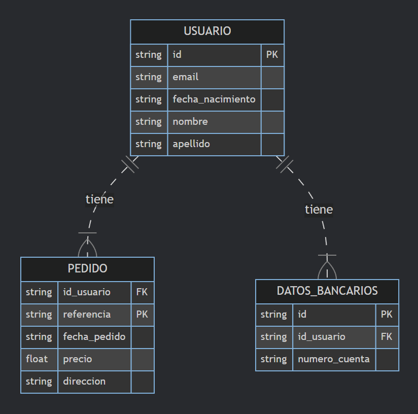

# Modelo Relacional

## Definición

El modelo relacional es el modelo de datos más utilizado en la actualidad. Los datos se organizan en tablas relacionadas entre sí mediante claves primarias y claves externas. Las relaciones entre las tablas se establecen a través de las claves externas, lo que permite realizar consultas complejas utilizando el lenguaje **SQL (Structured Query Language)**.

import Card from '@site/src/components/Card/Card';

## ¿Cómo crear un modelo relacional?

<Card>
### Identificar entidades

Identificar las entidades principales de los sistemas que se desean modelar. Estas son las cosas o conceptos sobre los cuales se desea almacenar información.

**Ejemplo:** En sistemas de gestión de bibliotecas, las entidades podrían ser:
- Libros
- Autores
- Usuarios
- Préstamos

</Card>

<Card>
### Identificar atributos

Para cada entidad identificada, determinar qué información se necesita almacenar. Estos son los atributos de las entidades.

**Ejemplo:** Para la entidad “libros”, los atributos podrían ser:
- Título
- Autor
- Año de publicación
</Card>

<Card>
### Identificar relaciones

Una relación describe cómo están conectadas dos entidades entre sí.

**Ejemplo:** En sistemas de gestión de bibliotecas, hay relaciones entre:
- “Libros” y “Autores” (un libro puede tener uno o más autores)
- “Préstamos” y “Usuarios” (un usuario puede realizar uno o más préstamos)
</Card>

<Card>
### Refinar relaciones

Especificar la cardinalidad y la naturaleza de las relaciones entre las entidades. La cardinalidad indica cuántos registros de una entidad pueden estar relacionados con cuántos registros de la otra entidad.

**Ejemplo:** 
- La relación entre “libros” y “autores” puede ser de uno a muchos (un libro tiene un autor, pero un autor puede escribir varios libros).
- Determinar si la relación es obligatoria u opcional.
</Card>

<Card>
### Diseñar esquema relacional

Una vez que se hayan identificado las entidades, atributos y relaciones, se puede diseñar el esquema relacional.

- Cada entidad se convierte en una tabla.
- Cada atributo en una columna.
- Cada relación en una clave foránea que conecta las tablas.

Se deben definir claves primarias para identificar de forma única cada registro en una tabla.
</Card>

<Card>
### Normalización

Aplicar reglas de normalización para eliminar redundancias y anomalías en el diseño de las bases de datos.

La normalización asegura que las bases de datos estén bien estructuradas y sean eficientes. Las formas normales más comunes son la primera forma normal (1NF), la segunda forma normal (2NF) y la tercera forma normal (3NF).
</Card>

<Card centerContent={true}>
## Ejemplo de un diagrama de modelo relacional

</Card>