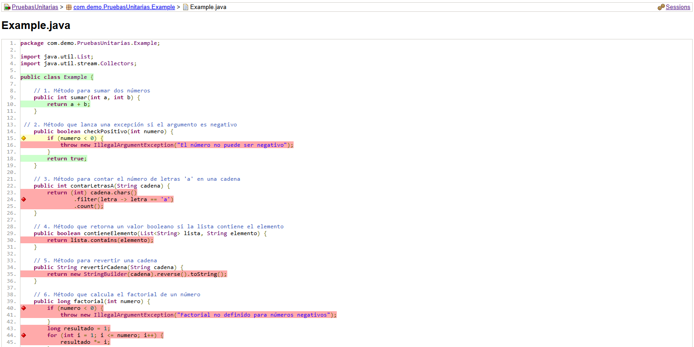

--- 

title: Jacoco

---


## Cobertura de las pruebas

La **cobertura de las pruebas** es una métrica que mide el porcentaje de código que ha sido ejecutado por las pruebas unitarias, es importante tener una alta cobertura de las pruebas para garantizar que el código esté bien probado y que se detecten posibles errores.

En JUnit, se puede utilizar la herramienta **JaCoCo** (Java Code Coverage) para medir la cobertura de las pruebas.

<Card>

### Instalación de JaCoCo (Java Code Coverage)

A continuación se presenta el código completo para agregar y configurar el plugin JaCoCo en el archivo pom.xml de Maven, en la siguiente pestaña, se proporciona un ejemplo simplificado que incluye solo la dependencia de JaCoCo con la configuración predeterminada.

<Tabs>
  <TabItem value="Importación extensa" label="Importación extensa">

  <Card>
    
    ```java title='Plugin JaCoCo en el archivo pom.xml para Maven'
    <plugin>
        <groupId>org.jacoco</groupId> // Grupo al que pertenece el plugin JaCoCo
        <artifactId>jacoco-maven-plugin</artifactId> // Identificador del plugin de JaCoCo
        <version>0.8.8</version> // Versión específica del plugin JaCoCo
        <executions>
            <execution>
                <goals>
                    <goal>prepare-agent</goal> // Prepara el agente JaCoCo para instrumentar el código y recopilar datos de cobertura 
                </goals>
            </execution>
            <execution>
                <id>report</id> // Identificador único para esta ejecución, llamado 'report' 
                <phase>test</phase> // Fase del ciclo de vida de Maven, 'test', en la que se ejecuta esta acción 
                <goals>
                    <goal>report</goal> // Genera un informe de cobertura después de ejecutar las pruebas 
                </goals>
                <configuration>
                    <excludes> // Excluye ciertas clases o paquetes de la cobertura de código para evitar falsos positivos
                        <exclude>**/Main.class</exclude> // Excluye la clase Main de la cobertura de código
                        <exclude>**/entity</exclude> // Excluye el paquete entity de la cobertura de código
                    </excludes>
                </configuration>
            </execution>
            <execution>
                <id>jacoco-check</id> // Identificador único para esta ejecución, llamado 'jacoco-check' 
                <goals>
                    <goal>check</goal> // Verifica que los umbrales de cobertura de código se cumplen 
                </goals>
                <configuration>
                    <rules>
                        <rule>
                            <element>PACKAGE</element> // Aplica la regla a nivel de paquete 
                            <limits> 
                                <limit>
                                    <counter>LINE</counter> // Verifica la cobertura de líneas de código
                                    <value>COVEREDRATIO</value> // Verifica porcentaje de cobertura
                                    <minimum>0.85</minimum> // Define el porcentaje mínimo de cobertura requerido, en este caso 85%
                                </limit>
                            </limits>
                        </rule>
                    </rules>
                </configuration>
            </execution>
        </executions>
    </plugin>
    ```    

:::tip
    Cuando el porcentaje de cobertura de las pruebas sea menor al 85%, el comando [`mvn test fallará`](#uso) y mostrará un mensaje de error. 
    
    Este mecanismo asegura que el código del proyecto mantenga una cobertura de pruebas adecuada antes de permitir que la construcción se complete con éxito, esta es una forma efectiva de forzar la calidad del código y garantizar que las áreas críticas estén bien probadas
:::    

  </Card>

  </TabItem>  

  <TabItem value="Importación simple" label="Importación simple">
    
    <Card>
        
    ```java title='Plugin JaCoCo en el archivo pom.xml para Maven'
    <plugin>
        <groupId>org.jacoco</groupId>
        <artifactId>jacoco-maven-plugin</artifactId>
        <version>0.8.8</version>
        <executions>
            <execution>
                <goals>
                    <goal>prepare-agent</goal>
                </goals>
            </execution>
            <execution>
                <id>report</id>
                <phase>test</phase>
                <goals>
                    <goal>report</goal>
                </goals>
            </execution>
        </executions>
    </plugin>
    ```

    </Card>

  </TabItem>
</Tabs>

</Card>

<Card>
    
## Uso

Para generar un informe de cobertura de las pruebas con JaCoCo, se debe ejecutar el siguiente comando en la terminal:

```bash
mvn clean test
```

:::danger
- La palabra `clean` es opcional y se utiliza para limpiar el directorio de destino antes de ejecutar las pruebas.

- El comando `test` ejecuta las pruebas unitarias y genera el informe de cobertura, esta palabra depende de la configurada en el archivo `pom.xml` en la etiqueta `<phase>`.
:::

</Card>

<Card>
    
## Resultados

Al ejecutar el comando anterior, se generará un informe de cobertura en el directorio `target/site/jacoco/index.html` que se puede abrir en un navegador web para ver los resultados.

El informe mostrará todas las clases del proyecto y el porcentaje de cobertura de las pruebas para cada una.

<Card>
   
## Resaltado de cobertura de código
 
El informe de JaCoCo resalta el código fuente con diferentes colores para indicar el nivel de cobertura de las pruebas:

<Card color='green'>
    
### Verde - `Completamente cubierto`

</Card>

<Card color='yellow'>
    
### Amarillo - `Parcialmente cubierto`

</Card>

<Card color='red'>
    
### Rojo - `No cubierto`

</Card>

</Card>

</Card>

<Card>

## Ejemplo de informe de cobertura

A continuación se muestra un ejemplo de un informe de cobertura generado por JaCoCo.




</Card>