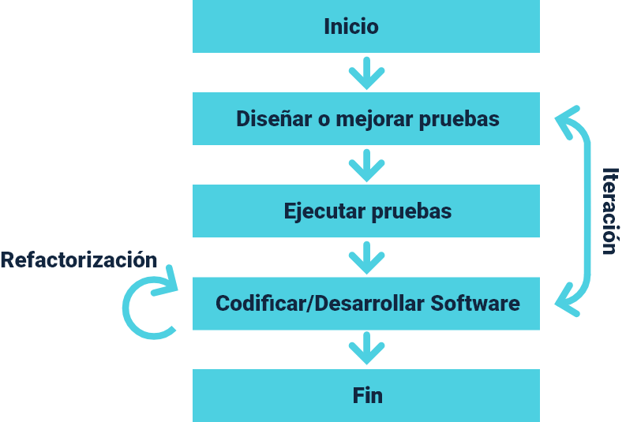

---

title: Test Driven Development (TDD)
slug: /tdd

---

El Test Driven Development, es un tipo de desarrollo donde se mantiene un exhaustivo juego de pruebas del programador, su objetivo principal es que ninguna parte del código pase a producción sin realizar antes las pruebas asociadas y tener la aprobación.

Se trata de un desarrollo orientado a las pruebas, donde cambia la mentalidad del equipo de desarrollo agilizando los resultados y aumentando la calidad del producto.

La tendencia actual es integrar TDD a cualquier metodología ya sea ágil (Scrum Alliance - TDD and Scrum, 2011) o tradicional (Letelier et al., s. f.), es aprovechar los beneficios de practicar una metodología que siempre permite deshacer los errores, asegurar una calidad del producto y protegerse de errores tanto malintencionados como humanos.

<Card color='white' solidBackground='true'>

</Card>