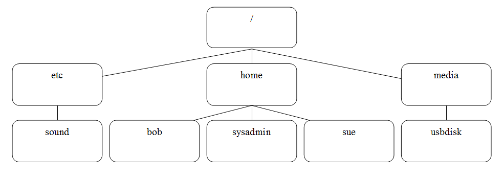

---

title: Gestión de los Archivos y Directorios
sidebar_position: 6

---

<Card>

<Row>
    


## «¿Quién más usa Linux en sus productos y servicios?»

</Row>

</Card>

Este apartado cubre los conceptos básicos sobre archivos y directorios en Linux. 

Un archivo es una colección de datos y que un directorio (o carpeta) es una estructura que organiza estos archivos. En Linux, todo es tratado como un archivo, incluidos los dispositivos y directorios.

<Card>
    
## Introducción a los Archivos y Directorios

En Linux, los archivos y directorios son fundamentales para la organización del sistema. Los archivos almacenan datos como texto, gráficos y programas, mientras que los directorios (o carpetas) proporcionan una estructura jerárquica para organizarlos.

A diferencia de los sistemas operativos como Microsoft Windows, donde la estructura de directorios se organiza en unidades (como C: o D:), Linux utiliza una estructura de directorios única bajo el directorio raíz /. No hay letras de unidad; en cambio, todos los dispositivos se montan bajo esta jerarquía.



### Estructura de Directorios en Linux:

El directorio raíz se representa con `/`.

- Ejemplo de comando para listar el sistema de archivos: `ls /`

```Bash
sysadmin@localhost:~$ ls /
bin   dev  home  lib    media  opt   root  sbin     selinux  sys  usr  
boot  etc  init  lib64  mnt    proc  run   sbin     srv   tmp  var
```

<Card>
    
## El directorio Path

Para ubicar archivos y directorios, se utilizan rutas. El directorio path es la ubicación de un archivo o directorio en el sistema de archivos.

### Tipos de rutas:

|Ruta Absoluta | Ruta Relativa |
|---|---|
|Empieza desde el directorio raíz `/` y proporciona la ubicación completa de un archivo o directorio. Ejemplo: `/etc/sound` |Se refiere a la ubicación en relación con el directorio actual. Ejemplo: `Documents` si estás en `/home/sysadmin.`|

El directorio `/etc` suele contener archivos de configuración.

</Card>

<Card>
    
### El Directorio Home

En Linux, cada usuario tiene un directorio personal bajo `/home`. El directorio home de un usuario se llama igual que el nombre del usuario. Por ejemplo, el directorio home del usuario `bob` es `/home/bob.`

- **Símbolo Especial**: `~` representa el directorio home del usuario actual. Ejemplo: Si tu directorio home es `/home/sysadmin`, puedes usar `~` en lugar de /home/sysadmin.

```Bash
sysadmin@localhost:~$ cd ~
sysadmin@localhost:~$ ls
Desktop  Documents  Downloads  Music  Pictures  Public  Templates  Videos
```

</Card>

<Card color='blue'>
    
## Diferencia entre el directorio home y el directorio raíz
<Card>
    

|Directorio Home | Directorio Raíz |
|---|---|
|Directorio personal de un usuario.  | Directorio raíz del sistema de archivos independiente de los usuarios.  |
|Se representa con un `~`             | Se representa con un `/` |
</Card>

</Card>

<Card>
    
## Directorio Actual

El directorio actual es el lugar donde estás trabajando en una terminal. Puedes determinarlo con el comando `pwd` (print working directory).

```Bash
sysadmin@localhost:~$ pwd
/home/sysadmin
```

El prompt normalmente muestra el directorio actual, pero para ver la ruta completa, usa `pwd`.

</Card>

<Card>
    
## Cambio de Directorios

Para cambiar el directorio actual, utiliza el comando cd (change directory). No recibirás salida si el comando tiene éxito, pero sí un error si el directorio no existe.

### Cambiar a un directorio específico:

```Bash
sysadmin@localhost:~$ cd /etc/sound/events
sysadmin@localhost:/etc/sound/events$
```

### Volver al directorio home:

```Bash
sysadmin@localhost:/etc/sound/events$ cd
sysadmin@localhost:~$ pwd
/home/sysadmin
```

También puedes usar `cd ~` para volver al directorio home.

</Card>

</Card>

<Card>
   
<Card>
 
### Lista de Colores

Existen varios tipos de archivos en Linux:

- **Archivo simple (plain file)**: No es un tipo especial de archivo, también conocido como archivo normal.
- **Directorio (directory)**: Contiene otros archivos.
- **Ejecutable (executable)**: Se puede ejecutar como un programa.
- **Enlace simbólico (symbolic link)**: Apunta a otro archivo.

En muchas distribuciones de Linux, los archivos se muestran codificados por colores según su tipo. Esto se logra con la opción `--color` del comando `ls`. Por ejemplo, los directorios pueden aparecer en azul, los archivos ejecutables en verde y los enlaces simbólicos en cian. Para evitar el uso de colores, usa una barra invertida antes del comando `ls`: `\ls`.

```Bash
sysadmin@localhost:~$ ls
Desktop  Documents  Downloads  Music  Pictures  Public  Templates  Videos
sysadmin@localhost:~$ \ls
Desktop  Documents  Downloads  Music  Pictures  Public  Templates  Videos
```

</Card>

<Card>

### Lista de Archivos Ocultos
Los archivos ocultos comienzan con un punto (.) y no se muestran por defecto con el comando ls. Para ver todos los archivos, incluyendo los ocultos, usa la opción -a:

```Bash
sysadmin@localhost:~$ ls -a
.             .bashrc   .selected_editor  Downloads  Public
..            .cache    Desktop           Music      Templates
.bash_logout  .profile  Documents         Pictures   Videos
```

La mayoría de los archivos ocultos son archivos de configuración que personalizan el funcionamiento de Linux, el shell o programas específicos.

</Card>

<Card>

### Listado con Visualización Larga
Para ver metadatos de los archivos, como el dueño, el tamaño y la última modificación, usa la opción `-l`:

```Bash
sysadmin@localhost:~$ ls -l
total 0
drwxr-xr-x 1 sysadmin sysadmin 0 Jan 29  2015 Desktop
drwxr-xr-x 1 sysadmin sysadmin 0 Jan 29  2015 Documents
drwxr-xr-x 1 sysadmin sysadmin 0 Jan 29  2015 Downloads
drwxr-xr-x 1 sysadmin sysadmin 0 Jan 29  2015 Music
drwxr-xr-x 1 sysadmin sysadmin 0 Jan 29  2015 Pictures
drwxr-xr-x 1 sysadmin sysadmin 0 Jan 29  2015 Public
drwxr-xr-x 1 sysadmin sysadmin 0 Jan 29  2015 Templates
drwxr-xr-x 1 sysadmin sysadmin 0 Jan 29  2015 Videos
```

Cada línea incluye:

- Tipo de archivo (`d` para directorio, `-` para archivo simple, `l` para enlace simbólico).
- Permisos del archivo.
- Conteo de enlaces físicos.
- Usuario propietario.
- Grupo propietario.
- Tamaño del archivo en bytes.
- Hora de modificación.
- Nombre del archivo o directorio.
- Tamaños Legibles

Para archivos grandes, los tamaños en bytes pueden ser difíciles de interpretar. Usa la opción `-h` junto con `-l` para mostrar tamaños en unidades legibles (KB, MB, GB):

```Bash
sysadmin@localhost:~$ ls -lh /usr/bin/omshell
-rwxr-xr-x 1 root root 1.5M Oct 9 2012 /usr/bin/omshell
```

</Card>

<Card>
    
### Tamaños legibles

Para archivos grandes, los tamaños en bytes pueden ser difíciles de interpretar. Usa la opción `-h` junto con `-l` para mostrar tamaños en unidades legibles (KB, MB, GB):

```Bash
sysadmin@localhost:~$ ls -lh /usr/bin/omshell
-rwxr-xr-x 1 root root 1.5M Oct 9 2012 /usr/bin/omshell
```

</Card>

</Card>

<Card>
    
## Lista de Directorios

El comando `ls -d` se refiere al directorio actual y no a su contenido. Sin opciones adicionales, puede parecer sin sentido. El directorio actual se representa con un solo punto (.).

```Bash
sysadmin@localhost:~$ ls -d
.
```

Para hacer útil el comando ls -d, es recomendable añadir la opción -l. Esto diferencia entre listar los contenidos del directorio y el propio directorio.

```Bash
sysadmin@localhost:~$ ls -l
total 0
drwxr-xr-x 1 sysadmin sysadmin   0 Apr 15  2015 Desktop
drwxr-xr-x 1 sysadmin sysadmin   0 Apr 15  2015 Documents
drwxr-xr-x 1 sysadmin sysadmin   0 Apr 15  2015 Downloads
drwxr-xr-x 1 sysadmin sysadmin   0 Apr 15  2015 Music
drwxr-xr-x 1 sysadmin sysadmin   0 Apr 15  2015 Pictures
drwxr-xr-x 1 sysadmin sysadmin   0 Apr 15  2015 Public
drwxr-xr-x 1 sysadmin sysadmin   0 Apr 15  2015 Templates
drwxr-xr-x 1 sysadmin sysadmin   0 Apr 15  2015 Videos
drwxr-xr-x 1 sysadmin sysadmin 420 Apr 15  2015 test
sysadmin@localhost:~$ ls -ld
drwxr-xr-x 1 sysadmin sysadmin 224 Nov  7 17:07 .
```

En el segundo ejemplo, se muestra el propio directorio actual (.) y no su contenido.

### Listado Recursivo

Para visualizar todos los archivos en un directorio y sus subdirectorios, usa la opción `-R`.

```Bash
sysadmin@localhost:~$ ls -R /etc/ppp
/etc/ppp:
chap-secrets   ip-down.ipv6to4    ip-up.ipv6to4    ipv6-up    pap-secrets
ip-down        ip-up              ipv6-down        options    peers

/etc/ppp/peers:
```

Es importante tener cuidado al usar -R en directorios grandes, ya que puede listar todos los archivos del sistema, incluyendo dispositivos USB y DVD.

### Ordenar un Listado
El comando ls ordena los archivos alfabéticamente por defecto. Para ordenar por tamaño, usa -S:

```Bash
sysadmin@localhost:~$ ls /etc/ssh
moduli           ssh_host_dsa_key.pub    ssh_host_rsa_key     sshd_config
ssh_config       ssh_host_ecdsa_key      ssh_host_rsa_key.pub
ssh_host_dsa_key ssh_host_ecdsa_key.pub  ssh_import_id

sysadmin@localhost:~$ ls -S /etc/ssh
moduli           ssh_host_dsa_key    ssh_host_ecdsa_key
sshd_config      ssh_host_dsa_key.pub ssh_host_ecdsa_key.pub
ssh_host_rsa_key ssh_host_rsa_key.pub
ssh_config       ssh_import_id
```

La opción -S es más útil con -l, mostrando los archivos del mayor al menor con sus tamaños:

```Bash
sysadmin@localhost:~$ ls -lS /etc/ssh
total 160
-rw-r--r-- 1 root root 125749 Apr 29  2014 moduli
-rw-r--r-- 1 root root   2489 Jan 29  2015 sshd_config
-rw------- 1 root root   1675 Jan 29  2015 ssh_host_rsa_key
-rw-r--r-- 1 root root   1669 Apr 29  2014 ssh_config
-rw------- 1 root root    668 Jan 29  2015 ssh_host_dsa_key
-rw-r--r-- 1 root root    607 Jan 29  2015 ssh_host_dsa_key.pub
-rw-r--r-- 1 root root    399 Jan 29  2015 ssh_host_rsa_key.pub
-rw-r--r-- 1 root root    302 Jan 10  2011 ssh_import_id
-rw------- 1 root root    227 Jan 29  2015 ssh_host_ecdsa_key
-rw-r--r-- 1 root root    179 Jan 29  2015 ssh_host_ecdsa_key.pub
```

Usa -h para tamaños legibles:

```Bash
sysadmin@localhost:~$ ls -lSh /etc/ssh
total 160K
-rw-r--r-- 1 root root 123K Apr 29  2014 moduli
-rw-r--r-- 1 root root 2.5K Jan 29  2015 sshd_config
-rw------- 1 root root 1.7K Jan 29  2015 ssh_host_rsa_key
-rw-r--r-- 1 root root 1.7K Apr 29  2014 ssh_config
-rw------- 1 root root  668 Jan 29  2015 ssh_host_dsa_key
-rw-r--r-- 1 root root  607 Jan 29  2015 ssh_host_dsa_key.pub
-rw-r--r-- 1 root root  399 Jan 29  2015 ssh_host_rsa_key.pub
-rw-r--r-- 1 root root  302 Jan 10  2011 ssh_import_id
-rw------- 1 root root  227 Jan 29  2015 ssh_host_ecdsa_key
-rw-r--r-- 1 root root  179 Jan 29  2015 ssh_host_ecdsa_key.pub
```

Para ordenar por fecha de modificación, usa -t:

```Bash
sysadmin@localhost:~$ ls -tl /etc/ssh
total 160
-rw------- 1 root root    668 Jan 29  2015 ssh_host_dsa_key
-rw-r--r-- 1 root root    607 Jan 29  2015 ssh_host_dsa_key.pub
-rw------- 1 root root    227 Jan 29  2015 ssh_host_ecdsa_key
-rw-r--r-- 1 root root    179 Jan 29  2015 ssh_host_ecdsa_key.pub
-rw------- 1 root root   1675 Jan 29  2015 ssh_host_rsa_key
-rw-r--r-- 1 root root    399 Jan 29  2015 ssh_host_rsa_key.pub
-rw-r--r-- 1 root root   2489 Jan 29  2015 sshd_config
-rw-r--r-- 1 root root 125749 Apr 29  2014 moduli
-rw-r--r-- 1 root root   1669 Apr 29  2014 ssh_config
-rw-r--r-- 1 root root    302 Jan 10  2011 ssh_import_id
```

Para más detalle, usa --full-time:

```Bash
sysadmin@localhost:~$ ls -t --full-time /etc/ssh
total 160
-rw------- 1 root root    668 2015-01-29 03:17:33.000000000 +0000 ssh_host_dsa_key
-rw-r--r-- 1 root root    607 2015-01-29 03:17:33.000000000 +0000 ssh_host_dsa_key.pub
-rw------- 1 root root    227 2015-01-29 03:17:33.000000000 +0000 ssh_host_ecdsa_key
-rw-r--r-- 1 root root    179 2015-01-29 03:17:33.000000000 +0000 ssh_host_ecdsa_key.pub
-rw------- 1 root root   1675 2015-01-29 03:17:33.000000000 +0000 ssh_host_rsa_key
-rw-r--r-- 1 root root    399 2015-01-29 03:17:33.000000000 +0000 ssh_host_rsa_key.pub
-rw-r--r-- 1 root root   2489 2015-01-29 03:17:33.000000000 +0000 sshd_config
-rw-r--r-- 1 root root 125749 2014-04-29 23:58:51.000000000 +0000 moduli
-rw-r--r-- 1 root root   1669 2014-04-29 23:58:51.000000000 +0000 ssh_config
-rw-r--r-- 1 root root    302 2011-01-10 18:48:29.000000000 +0000 ssh_import_id
```

La opción --full-time incluye automáticamente -l.

### Ordenación Inversa
Usa -r con -S o -t para ordenar de manera inversa:

```Bash
sysadmin@localhost:~$ ls -lrt /etc/ssh                                 
total 160                                                              
-rw-r--r-- 1 root root    302 Jan 10  2011 ssh_import_id               
-rw-r--r-- 1 root root   1669 Apr 29  2014 ssh_config                  
-rw-r--r-- 1 root root 125749 Apr 29  2014 moduli                      
-rw-r--r-- 1 root root   2489 Jan 29  2015 sshd_config                 
-rw-r--r-- 1 root root    399 Jan 29  2015 ssh_host_rsa_key.pub        
-rw------- 1 root root   1675 Jan 29  2015 ssh_host_rsa_key            
-rw-r--r-- 1 root root    179 Jan 29  2015 ssh_host_ecdsa_key.pub      
-rw------- 1 root root    227 Jan 29  2015 ssh_host_ecdsa_key          
-rw-r--r-- 1 root root    607 Jan 29  2015 ssh_host_dsa_key.pub        
-rw------- 1 root root    668 Jan 29  2015 ssh_host_dsa_key            
sysadmin@localhost:~$
```

</Card>

<Card>
     
## Copiar archivos y directorios

### Uso del comando `cp`

El comando `cp` se emplea para copiar archivos. Es necesario especificar tanto el archivo de origen como el de destino. La estructura del comando es:

```Bash
cp [fuente] [destino]
```

Donde: 

- `[fuente]` es el archivo que se desea copiar.
- `[destino]` es la ubicación donde se copiará el archivo.

### Comportamiento

Cuando el comando se ejecuta correctamente, no muestra ninguna salida, indicando que la operación fue exitosa.

### Ejemplo

Para copiar el archivo `/etc/hosts` al directorio `home`, se usa:

```Bash
sysadmin@localhost:~$ cp /etc/hosts ~
sysadmin@localhost:~$ ls
Desktop    Downloads  Pictures  Templates  hosts
Documents  Music      Public    Videos
sysadmin@localhost:~$
```

(El carácter `~` representa el directorio home del usuario actual).

### Modo Verbose en el Comando cp

### Uso de la opción -v

La opción `-v` (verbose) permite que el comando cp muestre una salida detallada cuando la operación es exitosa. La estructura del comando con esta opción es:

```Bash
cp -v [fuente] [destino]
```

**Ejemplo**

Al usar la opción `-v`, el comando `cp` proporciona una salida que muestra el origen y el destino del archivo copiado:

```Bash
sysadmin@localhost:~$ cp -v /etc/hosts ~
/etc/hosts' -> `/home/sysadmin/hosts'
sysadmin@localhost:~$
```

### Destinos como directorios

Cuando el destino es un directorio, el archivo copiado conserva el mismo nombre que el original. Para asignar un nombre diferente al nuevo archivo, se debe especificar el nombre deseado como parte del destino:

```Bash
sysadmin@localhost:~$ cp /etc/hosts ~/hosts.copy
sysadmin@localhost:~$ ls
Desktop    Downloads  Pictures  Templates  hosts
Documents  Music      Public    Videos     hosts.copy
sysadmin@localhost:~$
```

<Card>
    
<Card color='red'>

## Evitar Sobrescribir Datos
El comando cp reemplaza el contenido de un archivo de destino si ya existe. Esto puede causar pérdida de datos.

</Card>

Ejemplo:

Al intentar copiar `/etc/hosts` al mismo archivo y responder "no" a la pregunta de sobrescribir:

```Bash
sysadmin@localhost:~$ cp -i /etc/hosts ~/example.txt
cp: overwrite `/home/sysadmin/example.txt'? n
sysadmin@localhost:~$ ls -l example.txt
-rw-rw-r--. 1 sysadmin sysadmin 18 Sep 21 15:56 example.txt
```

### Opciones para Evitar Sobrescrituras

- **-i (Interactiva):** Pregunta antes de sobrescribir archivos.

```Bash
sysadmin@localhost:~$ cp -i /etc/hosts ~/example.txt
cp: overwrite `/home/sysadmin/example.txt'? n
```

- **-n (No sobrescribir):** No sobrescribe archivos existentes.

```Bash
sysadmin@localhost:~$ cp -n /etc/hosts ~/example.txt
cp: cannot create regular file `/home/sysadmin/example.txt': File exists
```
</Card>

<Card>
    
## Copiar Directorios

El comando cp no copia directorios por defecto. Al intentar copiar directorios, el comando muestra mensajes de error indicando que omite los directorios:

```Bash
sysadmin@localhost:~$ cp -i /etc/skel/.* ~
cp: omitting directory `/etc/skel/.' 
cp: omitting directory `/etc/skel/..'
cp: overwrite `/home/sysadmin/.bash_logout'? n
```

### Uso de la Opción -r

Para copiar directorios junto con su contenido, se debe usar la opción `-r` (recursiva). Esta opción copia la estructura completa del directorio, incluidos todos los archivos y subdirectorios:

```Bash
sysadmin@localhost:~$ cp -r /etc/skel/ ~
```

<Card color='red'>
    
**Precaución**

_Al usar la opción `-r`, se copiará toda la estructura del directorio, lo que puede resultar en la copia de muchos archivos y subdirectorios._

</Card>

</Card>

</Card>

<Card>
    
## Mover los archivos

### Uso del comando `mv`

Para mover archivos, se utiliza el comando `mv`. La sintaxis es similar a la del comando `cp`:

```Bash
mv [fuente] [destino]
```

**Ejemplo:**

Para mover el archivo hosts del directorio actual al directorio Videos:

```Bash
sysadmin@localhost:~$ ls
Desktop    Downloads  Pictures  Templates  example.txt  hosts.copy
Documents  Music      Public    Videos     hosts
sysadmin@localhost:~$ mv hosts Videos
sysadmin@localhost:~$ ls
Desktop    Downloads  Pictures  Templates  example.txt  hosts.copy
Documents  Music      Public    Videos
sysadmin@localhost:~$ ls Videos
hosts
```

### Comportamiento

Al mover un archivo, se elimina de la ubicación original y se coloca en la nueva ubicación. Los usuarios necesitan permisos adecuados para eliminar archivos de un directorio. Si no tienes los permisos necesarios, recibirás un mensaje de error como `Permission denied`:

```Bash
sysadmin@localhost:~$ mv /etc/hosts .
mv: cannot move `/etc/hosts' to `./hosts': Permission denied
```

### Mover los Archivos Mientras se Cambia el Nombre

Para cambiar el nombre de un archivo mientras se mueve, se debe especificar el nuevo nombre en el destino:

```Bash
sysadmin@localhost:~$ mv hosts Videos/hosts.copy
sysadmin@localhost:~$ ls Videos
hosts  hosts.copy
```

</Card>

<Card>
    
## Renombrar los Archivos

El comando `mv` no sólo se utiliza para mover un archivo, sino también cambiar el nombre de un archivo. Por ejemplo, los siguientes comandos cambiarán el nombre del archivo `hosts.copy` a `hosts.bak`:

```Bash
sysadmin@localhost:~$ cd Videos
sysadmin@localhost:~/Videos$ ls
hosts  hosts.copy
sysadmin@localhost:~/Videos$ mv hosts.copy hosts.bak
sysadmin@localhost:~/Videos$ ls
hosts  hosts.bak
sysadmin@localhost:~/Videos$
```

Piensa en el ejemplo anterior del mv que significa «mover el archivo hosts.copy a la ubicación de hosts.bak y cambiar su nombre a la vez».

</Card>

<Card>
    
## Crear Archivos

Existen varias formas de crear archivos. Una opción es utilizar un editor de texto, que se abordará en un capítulo posterior. Otra forma es crear un archivo vacío que se puede llenar con datos más tarde. Esto es útil para indicar la existencia de un archivo que se creará en el futuro o para alterar el comportamiento de comandos o servicios en el sistema operativo.

### Uso del Comando `touch`

Para crear un archivo vacío, se puede usar el comando `touch`. Este comando crea un archivo nuevo sin datos:

```Bash
sysadmin@localhost:~$ ls
Desktop  Documents  Downloads  Music  Pictures  Public  Templates  Videos
sysadmin@localhost:~$ touch sample
sysadmin@localhost:~$ ls -l sample
-rw-rw-r-- 1 sysadmin sysadmin 0 Nov  9 16:48 sample
```

**NOTA**: El tamaño del archivo nuevo es 0 bytes, ya que touch no agrega datos al archivo creado.

</Card>

<Card>
    
## Eliminar Archivos

### Uso del Comando `rm`

Para borrar archivos, se utiliza el comando `rm`. Este comando elimina archivos sin hacer preguntas:

```Bash
sysadmin@localhost:~$ ls
Desktop    Downloads  Pictures  Templates  sample
Documents  Music      Public    Videos
sysadmin@localhost:~$ rm sample
sysadmin@localhost:~$ ls
Desktop  Documents  Downloads  Music  Pictures  Public  Templates  Videos
sysadmin@localhost:~$
```

<Card color='red'>

**Precauciones:**

- **Eliminación Sin Confirmación:** `rm` elimina archivos sin solicitar confirmación, lo que puede llevar a la eliminación accidental de varios archivos si se usan patrones de búsqueda, como `rm *.txt`.

- **Eliminación Permanente:** Los archivos se eliminan de forma permanente sin posibilidad de recuperación. No hay **"papelera de reciclaje"** para recuperar archivos borrados.

</Card>

### Uso de la Opción -i

Para solicitar confirmación antes de eliminar un archivo, se puede usar la opción `-i` (interactiva):

```Bash
sysadmin@localhost:~$ touch sample.txt example.txt test.txt
sysadmin@localhost:~$ ls
Desktop    Downloads  Pictures  Templates  example.txt  test.txt
Documents  Music      Public    Videos     sample.txt
sysadmin@localhost:~$ rm -i *.txt
rm: remove regular empty file `example.txt'? y
rm: remove regular empty file `sample.txt'? n
rm: remove regular empty file `test.txt'? y
sysadmin@localhost:~$ ls
Desktop    Downloads  Pictures  Templates  sample.txt
Documents  Music      Public    Videos
```

En el ejemplo anterior, se eliminaron los archivos `example.txt` y `test.txt`, pero no `sample.txt`.


</Card>

<Card>
    
## Eliminar directorios

El comando `rm` por defecto no elimina directorios:

```Bash
sysadmin@localhost:~$ rm Videos
rm: cannot remove `Videos': Is a directory
sysadmin@localhost:~$
```

### Eliminar Directorios con `-r`

Para eliminar directorios y su contenido, se debe usar la opción `-r` (recursiva):

```Bash
sysadmin@localhost:~$ rm -r Videos
sysadmin@localhost:~$ ls
Desktop    Documents  Downloads  Music  Pictures  Public  Templates  sample.txt
sysadmin@localhost:~$
```

<Card color='red'>
    
**Eliminación Sin Confirmación:** Al usar `rm -r`, todos los archivos y subdirectorios dentro del directorio se eliminan sin confirmación. Para evitar eliminar archivos accidentalmente, se recomienda usar la opción `-i` junto con `-r`:

<Card>
    
```Bash
sysadmin@localhost:~$ rm -ri Videos
rm: remove directory `Videos'? y
```

</Card>

</Card>

**Uso del Comando rmdir**

- También se puede eliminar un directorio vacío con el comando rmdir:

```Bash
sysadmin@localhost:~$ ls
Desktop    Documents  Downloads  Music  Pictures  Public  Templates  sample.txt  test
sysadmin@localhost:~$ rmdir test
sysadmin@localhost:~$ ls
Desktop    Documents  Downloads  Music  Pictures  Public  Templates  sample.txt
sysadmin@localhost:~$
```

</Card>

<Card>
    
## Crear Directorios

### Uso del Comando `mkdir`

Para crear un directorio, se utiliza el comando `mkdir`. La estructura del comando es:

```Bash
mkdir [nombre del directorio]
```

**Ejemplo:**

Para crear un directorio llamado `test`:

```Bash
sysadmin@localhost:~$ ls
Desktop    Documents  Downloads  Music  Pictures  Public  Templates  sample.txt
sysadmin@localhost:~$ mkdir test
sysadmin@localhost:~$ ls
Desktop    Documents  Downloads  Music  Pictures  Public  Templates  sample.txt  test
sysadmin@localhost:~$
```

</Card>